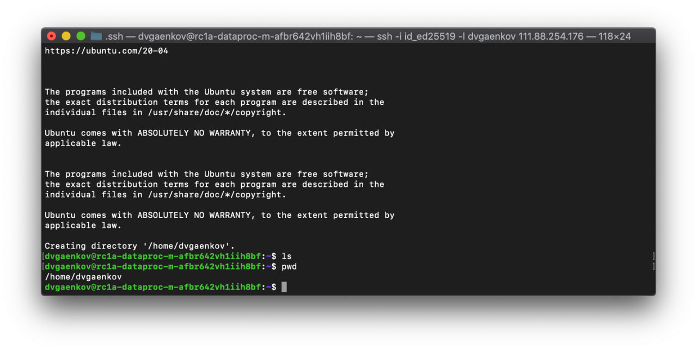
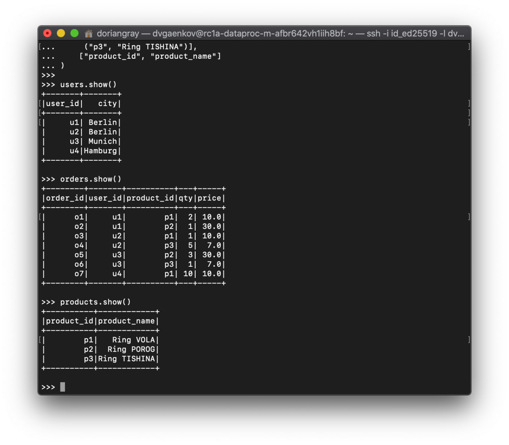
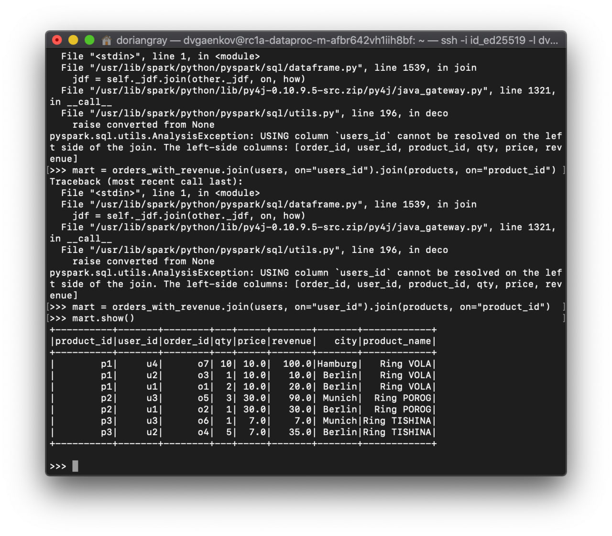
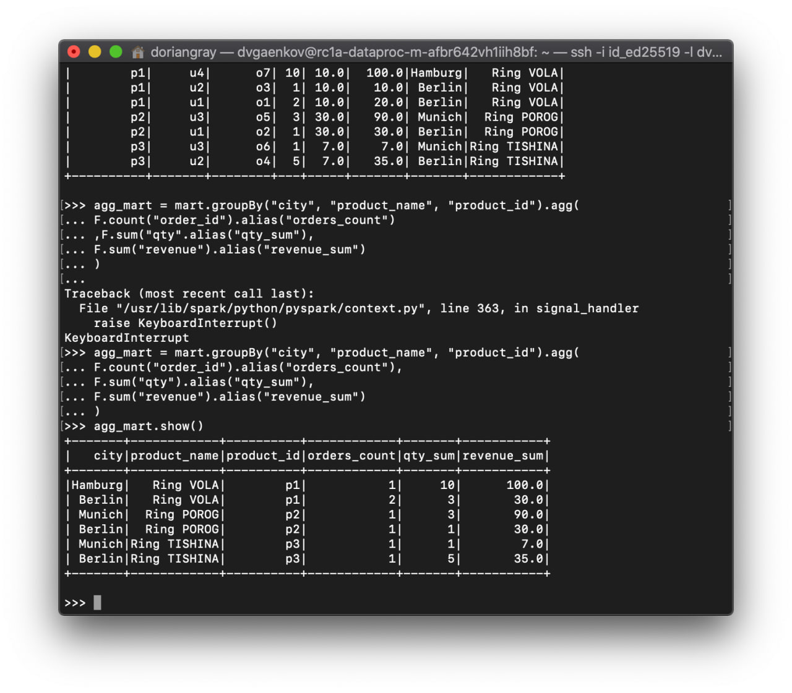
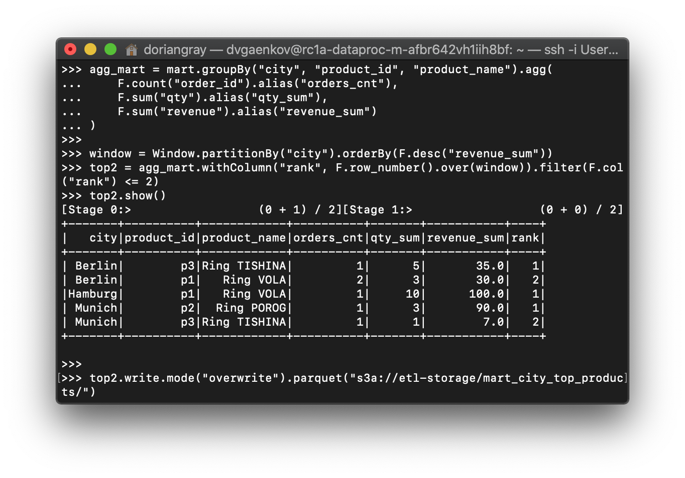
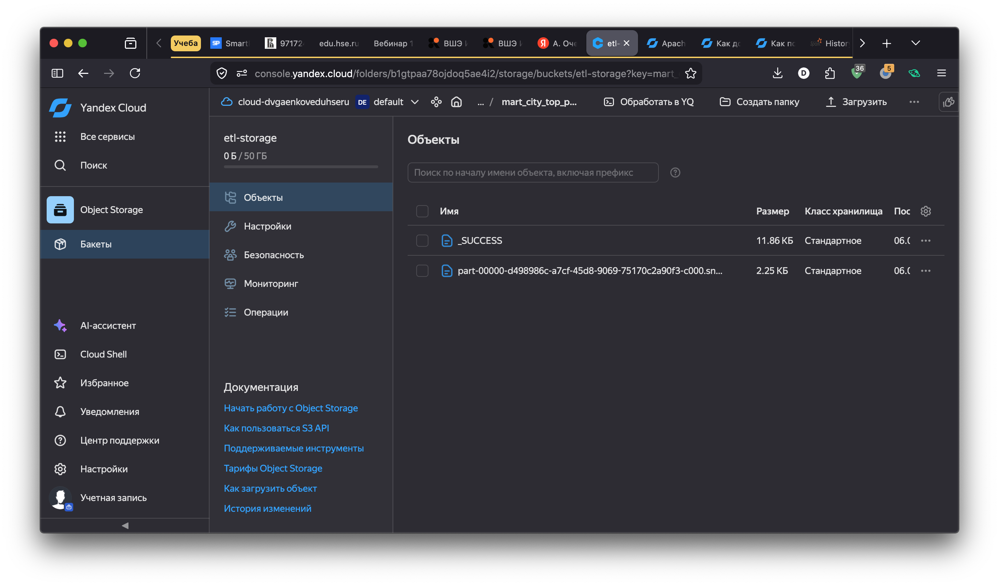

# Отчёт: Работа с Big Data в Yandex Cloud
> Выполнил Гаенков Даниил Вадимович

## Цель работы
Развернуть кластер Hadoop и Spark с помощью Yandex Data Processing, загрузить данные, провести трансформацию и записать результат в хранилище.
---

## 1. Развёртывание кластера Yandex Data Processing

Был создан кластер `dataproc-etl` на базе Yandex Data Processing со следующей конфигурацией:

- **Образ:** Dataproc 2.0
- **Сервисы:** HDFS, YARN, Spark
- **Мастер-нода:** 1 × s3.micro (2 vCPU, 8 GB RAM), зона `ru-central1-a`
- **Data-ноды:** 2 × s3.micro (2 vCPU, 8 GB RAM), зона `ru-central1-a`
- **Хранилище:** S3-бакет `etl-storage`

Для подключения к мастер-ноде был добавлен внешний IP и выполнено подключение по SSH:

```bash
ssh -i id_ed25519 -l dvgaenkov 111.88.254.176
```



---

## 2. Загрузка данных

Тестовые данные были созданы напрямую в PySpark-сессии. Использовались три датафрейма:

- **users** — пользователи и их города
- **orders** — заказы с количеством и ценой
- **products** — справочник товаров

```python
from pyspark.sql import functions as F

users = spark.createDataFrame(
    [("u1", "Berlin"), ("u2", "Berlin"), ("u3", "Munich"), ("u4", "Hamburg")],
    ["user_id", "city"]
)

orders = spark.createDataFrame(
    [("o1", "u1", "p1", 2, 10.0), ("o2", "u1", "p2", 1, 30.0),
     ("o3", "u2", "p1", 1, 10.0), ("o4", "u2", "p3", 5, 7.0),
     ("o5", "u3", "p2", 3, 30.0), ("o6", "u3", "p3", 1, 7.0),
     ("o7", "u4", "p1", 10, 10.0)],
    ["order_id", "user_id", "product_id", "qty", "price"]
)

products = spark.createDataFrame(
    [("p1", "Ring VOLA"), ("p2", "Ring POROG"), ("p3", "Ring TISHINA")],
    ["product_id", "product_name"]
)
```



---

## 3. Трансформация данных

### 3.1 Вычисление revenue и объединение таблиц

Была вычислена производная метрика `revenue = qty * price`, после чего таблицы объединены через join:

```python
orders_with_revenue = orders.withColumn("revenue", F.col("qty") * F.col("price"))

mart = orders_with_revenue \
    .join(users, on="user_id") \
    .join(products, on="product_id")
```



### 3.2 Агрегация по городу и товару

Подсчитаны метрики по группам `(city, product_id, product_name)`:

```python
agg_mart = mart.groupBy("city", "product_id", "product_name").agg(
    F.count("order_id").alias("orders_cnt"),
    F.sum("qty").alias("qty_sum"),
    F.sum("revenue").alias("revenue_sum")
)
```



### 3.3 Top-2 товара по городу с использованием оконных функций

С помощью `Window` и `row_number()` для каждого города были выбраны два товара с наибольшим `revenue_sum`:

```python
from pyspark.sql import Window

window = Window.partitionBy("city").orderBy(F.desc("revenue_sum"))

top2 = agg_mart \
    .withColumn("rank", F.row_number().over(window)) \
    .filter(F.col("rank") <= 2)

top2.show()
```



Результат:

| city    | product_id | product_name | orders_cnt | qty_sum | revenue_sum | rank |
|---------|------------|--------------|------------|---------|-------------|------|
| Berlin  | p3         | Ring TISHINA | 1          | 5       | 35.0        | 1    |
| Berlin  | p1         | Ring VOLA    | 2          | 3       | 30.0        | 2    |
| Hamburg | p1         | Ring VOLA    | 1          | 10      | 100.0       | 1    |
| Munich  | p2         | Ring POROG   | 1          | 3       | 90.0        | 1    |
| Munich  | p3         | Ring TISHINA | 1          | 1       | 7.0         | 2    |

---

## 4. Запись результатов

### 4.1 Запись в S3

```python
top2.write.mode("overwrite").parquet("s3a://etl-storage/mart_city_top_products/")
```



В бакете `etl-storage` появились файлы:
- `_SUCCESS` — признак успешной записи
- `part-00000-....snappy.parquet` — данные в формате Parquet

## 5. Проверка результата

Данные были прочитаны обратно из S3 для верификации:

```python
result = spark.read.parquet("s3a://etl-storage/mart_city_top_products/")
result.show()
```

---